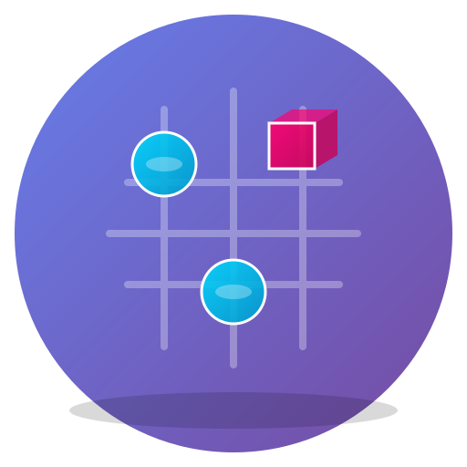

# 🎮 3D Tic-Tac-Toe

<div align="center">
  
  
  <p align="center">
    Experience the classic Tic-Tac-Toe game in stunning 3D!
    <br />
    <strong>Play with interactive spheres and cubes in a beautiful three-dimensional environment.</strong>
  </p>

  <p align="center">
    <a href="#features">Features</a> •
    <a href="#demo">Demo</a> •
    <a href="#technologies">Technologies</a> •
    <a href="#installation">Installation</a> •
    <a href="#deployment">Deployment</a> •
    <a href="#license">License</a>
  </p>
</div>

---

## ✨ Features

- **🎨 Stunning 3D Graphics**: Built with React Three Fiber and Three.js for smooth, interactive 3D rendering
- **🎯 Interactive Gameplay**: Click on the 3D grid to place your moves
- **🔄 Smooth Animations**: Beautifully animated spheres and cubes with React Spring
- **🎊 Victory Celebrations**: Confetti effects and visual feedback when you win
- **📱 Responsive Design**: Play on any device - desktop, tablet, or mobile
- **🌓 Modern UI**: Clean interface with shadcn/ui components and Tailwind CSS
- **🖱️ Intuitive Controls**: 
  - Click to play
  - Drag to rotate the board
  - Scroll to zoom in/out
- **♻️ Reset Anytime**: Quick restart button to play again
- **🏆 Win Detection**: Automatic detection of winning combinations and ties

## 🎬 Demo

[Live Demo](https://your-deployment-url.vercel.app) *(Will be available after deployment)*

### Screenshots

*Game features beautiful 3D rendered spheres and cubes on an interactive grid with dynamic lighting and shadows.*

## 🛠️ Technologies

This project is built with modern web technologies:

### Frontend Framework
- **React 18** - UI library
- **TypeScript** - Type-safe JavaScript
- **Vite** - Next-generation frontend tooling

### 3D Graphics
- **Three.js** - 3D graphics library
- **React Three Fiber** - React renderer for Three.js
- **@react-three/drei** - Useful helpers for R3F
- **@react-spring/three** - Spring animations for 3D objects

### UI & Styling
- **Tailwind CSS** - Utility-first CSS framework
- **shadcn/ui** - Re-usable component library
- **Radix UI** - Unstyled, accessible components
- **Lucide React** - Beautiful icon library

### State Management & Routing
- **React Router DOM** - Client-side routing
- **TanStack Query** - Data fetching and caching
- **React Hook Form** - Form management
- **Zod** - TypeScript-first schema validation

## 📦 Installation

### Prerequisites

- **Node.js** (v18 or higher) - [Download](https://nodejs.org/)
- **npm** or **yarn** package manager

### Setup Instructions

1. **Clone the repository**
   ```bash
   git clone https://github.com/Narendra-Rajput003/3D-Tic-tac-toe.git
   cd 3D-Tic-tac-toe
   ```

2. **Install dependencies**
   ```bash
   npm install
   # or
   yarn install
   ```

3. **Start the development server**
   ```bash
   npm run dev
   # or
   yarn dev
   ```

4. **Open your browser**
   
   Navigate to `http://localhost:8080`

### Available Scripts

- `npm run dev` - Start development server
- `npm run build` - Build for production
- `npm run build:dev` - Build in development mode
- `npm run preview` - Preview production build locally
- `npm run lint` - Run ESLint for code quality

## 🎮 How to Play

### Game Modes

**Play with Friend** 👥
- Two players take turns on the same device
- Player 1 plays as Sphere (🔵)
- Player 2 plays as Cube (🟥)

**Play with Computer** 🤖
- Play against an AI opponent
- You play as Sphere (🔵)
- Computer plays as Cube (🟥)
- AI uses minimax algorithm for smart moves

### How to Play

1. **Choose Game Mode**: Select "Play with Friend" or "Play with Computer"
2. **Make Your Move**: Click on any empty cell in the 3D grid
3. **Take Turns**: Players/AI alternate between Sphere and Cube
4. **Win the Game**: Get three in a row horizontally, vertically, or diagonally
5. **Rotate & Zoom**: Use your mouse to rotate the board and scroll to zoom
6. **Play Again**: Click "Play Again" or "Change Mode" after game ends

## 🚀 Deployment

### Deploy to Vercel (Recommended)

1. **Install Vercel CLI** (optional)
   ```bash
   npm install -g vercel
   ```

2. **Deploy using Vercel CLI**
   ```bash
   vercel
   ```

3. **Or Deploy via GitHub**
   - Push your code to GitHub
   - Go to [Vercel](https://vercel.com)
   - Import your repository
   - Vercel will automatically detect Vite and deploy

### Deploy to Netlify

1. **Build the project**
   ```bash
   npm run build
   ```

2. **Deploy to Netlify**
   - Drag and drop the `dist` folder to [Netlify Drop](https://app.netlify.com/drop)
   - Or use Netlify CLI:
     ```bash
     npm install -g netlify-cli
     netlify deploy --prod
     ```

### Environment Configuration

No environment variables are required for basic functionality.

## 📁 Project Structure

```
3d-tic-tac-toe/
├── public/
│   ├── logo.svg          # Application logo
│   ├── robots.txt        # SEO robots file
│   └── placeholder.svg   # Placeholder assets
├── src/
│   ├── components/
│   │   ├── ui/          # shadcn/ui components
│   │   ├── GameBoard.tsx    # Main 3D game board
│   │   ├── GameInfo.tsx     # Game status display
│   │   ├── Confetti.tsx     # Victory animation
│   │   ├── SphereMesh.tsx   # 3D sphere component
│   │   ├── CubeMesh.tsx     # 3D cube component
│   │   ├── GridLine.tsx     # Grid lines component
│   │   └── WinnerLine.tsx   # Winning line indicator
│   ├── hooks/          # Custom React hooks
│   ├── lib/            # Utility functions
│   ├── pages/
│   │   ├── Index.tsx       # Main game page
│   │   └── NotFound.tsx    # 404 page
│   ├── App.tsx         # Root component
│   ├── main.tsx        # Application entry
│   └── index.css       # Global styles
├── index.html          # HTML template
├── package.json        # Dependencies
├── tsconfig.json       # TypeScript config
├── tailwind.config.ts  # Tailwind config
├── vite.config.ts      # Vite config
└── README.md          # This file
```

## 🎨 Customization

### Modify Game Colors

Edit the colors in `src/pages/Index.tsx`:

```tsx
<pointLight position={[-5, -5, 5]} intensity={0.5} color="#00d9ff" />
<pointLight position={[5, -5, 5]} intensity={0.5} color="#ff006e" />
```

### Change Board Size

Modify the grid size in `src/components/GameBoard.tsx`

### Adjust Camera Position

Update camera settings in `src/pages/Index.tsx`:

```tsx
<Canvas camera={{ position: [0, 0, 6], fov: 50 }} />
```

## 🤝 Contributing

Contributions are welcome! Please feel free to submit a Pull Request.

1. Fork the repository
2. Create your feature branch (`git checkout -b feature/AmazingFeature`)
3. Commit your changes (`git commit -m 'Add some AmazingFeature'`)
4. Push to the branch (`git push origin feature/AmazingFeature`)
5. Open a Pull Request

## 📝 License

This project is licensed under the MIT License - see the LICENSE file for details.

## 🙏 Acknowledgments

- **React Three Fiber** team for the amazing 3D React library
- **Three.js** community for the powerful 3D engine
- **shadcn/ui** for the beautiful component library
- **Vercel** for seamless deployment

## 📧 Contact

For questions or feedback, please open an issue on GitHub.

---

<div align="center">
  Made with ❤️ using React Three Fiber
  <br />
  <strong>Star ⭐ this repository if you found it helpful!</strong>
</div>
